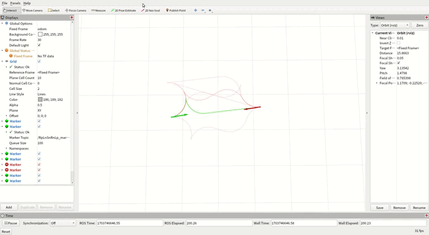

# reeds-shepp_curve
​	已经有ROS的话，直接clone下来Cmake后运行即可：

```g
git clone https://github.com/Raiden49/reeds-shepp_curve.git
```

```
cd rs_curve
cmake -B ./build 
cmake --build ./build
source ./build/devel/setup.bash
roslaunch rs_curve rs_curve.launch
```

​	Reeds-shepp曲线类型种类太多，所以我只随机绘制了几条曲线出来，绿色的不透明度最高，为最优曲线


